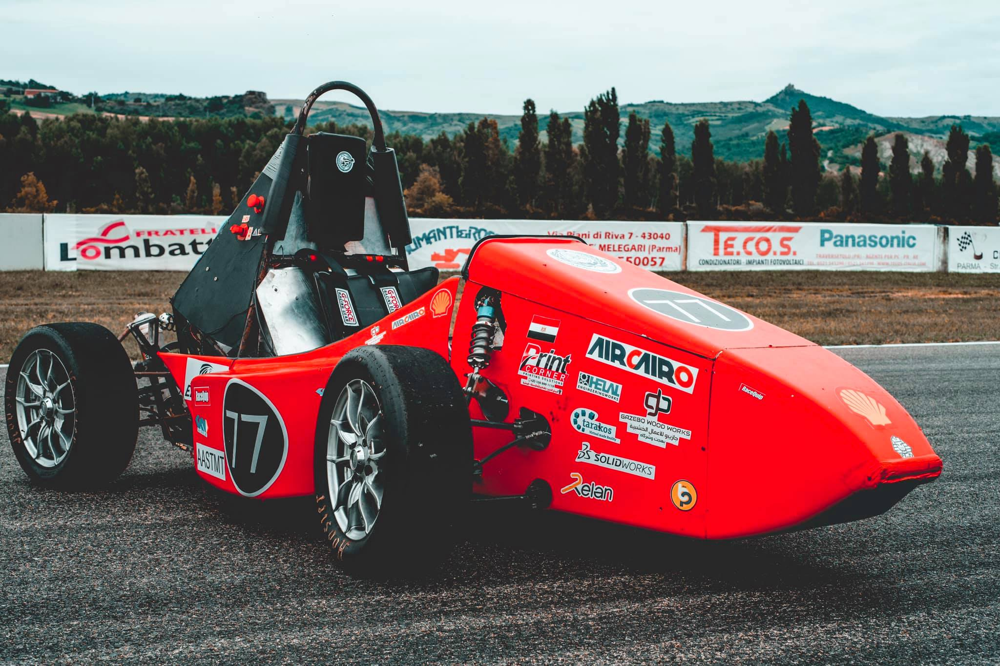

<!-- PROJECT LOGO -->
<br />
<p align="center">
  <a href="https://github.com/AAM-Driverless/aamfsd_pp_2022">
    
  </a>

  <h3 align="center">Arab Academy Motors</h3>

  <p align="center">
    AAM Path Planning subteam
    <br />
    <br />
    <br />
    <a href="https://github.com/AAM-Driverless/aamfsd_pp_2022/blob/master/Rules/FSAE_Rules_2021_V1.pdf">Rules</a>
    ·
    <a href="https://github.com/AAM-Driverless/aamfsd_pp_2022/issues">Report issue</a>
    ·
    <a href="https://github.com/AAM-Driverless/aamfsd_pp_2022/tree/master/src/aam_control">Path Planning Packages</a>
  </p>
</p>


<!-- TABLE OF CONTENTS -->
<details open="open">
  <summary>Table of Contents</summary>
  <ol>
    <li>
      <a href="#About AAM-Driverless">About AAM-Driverless</a>
      <ul>
    <li>
      <a href="#getting-started">Getting Started</a>
      <ul>
        <li><a href="#prerequisites">Prerequisites</a></li>
        <li><a href="#installation">Installation</a></li>
      </ul>
    </li>
    <li><a href="#usage">Usage</a></li>
    <li><a href="#contributing">Contributing</a></li>
    <li><a href="#license">License</a></li>
    <li><a href="#contact">Contact</a></li>
  </ol>
</details>


<!-- ABOUT THE PROJECT -->
## About AAM-Driverless

our team installs an autonomous function in the race vehicle, a simple,computational efficient yet robust pipeline was our target. State-of-the-art algorithms were adopted in perception, state estimation, path planning, and control.


<!-- GETTING STARTED -->
## Getting Started

This simulation uses gazebo and ROS (robot operating system) 

### Prerequisites

This is an example of how to list things you need to use the software and how to install them.
* ROS melodic
  ```sh
  sudo sh -c 'echo "deb http://packages.ros.org/ros/ubuntu $(lsb_release -sc) main" > /etc/apt/sources.list.d/ros-latest.list'
  ```
```sh
sudo apt install curl
  ```
  ```sh
curl -s https://raw.githubusercontent.com/ros/rosdistro/master/ros.asc | sudo apt-key add -
  ```
  ```sh
sudo apt update
  ```
  ```sh
sudo apt install ros-melodic-desktop-full
  ```
  ```sh
echo "source /opt/ros/melodic/setup.bash" >> ~/.bashrc
  ```
  ```sh
source ~/.bashrc
  ```
  ```sh
sudo apt install python-rosdep python-rosinstall python-rosinstall-generator python-wstool build-essential
  ```
  ```sh
sudo apt install python-rosdep
  ```
  ```sh
sudo rosdep init
  ```
  ```sh
rosdep update
  ```

* ROS (other packages)
```sh
sudo apt-get install ros-melodic-ackermann-msgs 
  ```
  ```sh
sudo apt-get install ros-melodic-twist-mux 
  ```
  ```sh
sudo apt-get install ros-melodic-joy 
  ```
  ```sh
sudo apt-get install ros-melodic-controller-manager 
  ```
  ```sh
sudo apt-get install ros-melodic-velodyne-simulator 
  ```
  ```sh
sudo apt-get install ros-melodic-effort-controllers 
  ```
  ```sh
sudo apt-get install ros-melodic-velocity-controllers 
  ```
  ```sh
sudo apt-get install ros-melodic-joint-state-controller 
  ```
  ```sh
sudo apt-get install ros-melodic-gazebo-ros-control 
  ```
  ```sh
sudo apt-get install ros-melodic-velodyne
  ```

* PCL (Point Cloud Library)
```sh
git clone https://github.com/PointCloudLibrary/pcl.git 
```
```sh
cd pcl
  ```
  ```sh
mkdir release 
  ```
  ```sh
cd release
  ```
  ```sh
cmake -DCMAKE_BUILD_TYPE=None -DCMAKE_INSTALL_PREFIX=/usr \ -DBUILD_GPU=ON-DBUILD_apps=ON -DBUILD_examples=ON \ -DCMAKE_INSTALL_PREFIX=/usr .. 
  ```
  ```sh
make
  ```

### Installation

1. Clone the repo
```sh
   git clone https://github.com/AAM-Driverless/aamfsd_pp_2022.git
```
2. go to ws
```sh
cd aamfsd_pp_2022
   ```
3. build your the workspace
```sh
catkin_make
   ```


<!-- USAGE EXAMPLES -->
## Usage

to launch the car and tracks **gazebo simulator**.
1. acceleration
```sh
source devel/setup.bash
```
```sh
roslaunch aamfsd_gazebo acceleration.launch
```
2. skidpad
```sh
source devel/setup.bash
```
```sh
roslaunch aamfsd_gazebo skidpad.launch
```
3. small track
```sh
source devel/setup.bash
```
```sh
roslaunch aamfsd_gazebo small_track.launch
```
4. big track
```sh
source devel/setup.bash
```
```sh
roslaunch aamfsd_gazebo big_track.launch
```

to launch the car **controller**.

1. acceleration
```sh
source devel/setup.bash
```
```sh
roslaunch robot_control rqt_robot_control.launch
```


<!-- CONTRIBUTING -->
## Contributing

Everyone submits their work on by committing it **in their own branch** and keep updating it though out the season .

1. clone repo
2. write your code
2. Create your Branch with your name (`git checkout -b feature/AmazingFeature`)
3. Commit your Changes (`git commit -m 'Add text that describe your code'`)
4. Push to the Branch (`git push origin feature/AmazingFeature`)


<!-- LICENSE -->
## License

This workspace is a private property of AAM team please don't share it online 


<!-- CONTACT -->
## Contact

Omar El-Fayoumi - omarselfayoumi@gmail.com

Project Link: [https://github.com/AAM-Driverless/aamfsd_pp_2022](https://github.com/AAM-Driverless/aamfsd_pp_2022)
